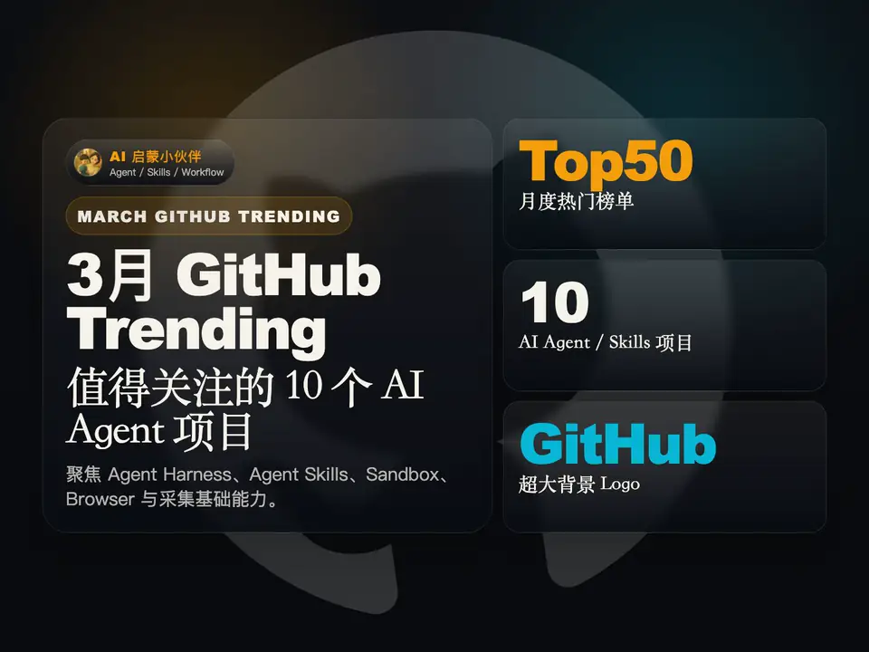

# infocard-video-skills

[](./docs/media/github-trending-agents-top10-4x3.mp4)

[下载演示视频](./docs/media/github-trending-agents-top10-4x3.mp4)

面向 Agent 的可复用 Remotion 视频技能仓库，用于结构化短视频制作。

[English](./README.md)

## 仓库定位

`infocard-video-skills` 是一个视频能力仓库，不是信息卡仓库，也不是某个单独视频案例的归档目录。

它的目标是把已经验证过的 Remotion 视频制作方法沉淀成可以长期维护、复用、发布的 Skill 体系，包括：

- 可安装的 Skill
- 工作流参考文档
- 轻量辅助脚本
- 小型验证性示例

这个仓库默认建立在上游 `remotion-best-practices` skill 之上：

- `remotion-best-practices` 负责 Remotion 层面的通用规范
- `remotion-video-workflow` 负责你们已经验证过的短视频工作流和约束

## 当前状态

当前阶段已经完成：

- 仓库目录骨架
- 主 Skill 包
- 工作流参考文档
- GitHub 发布所需的仓库级说明

当前阶段还没有做：

- 完整 Remotion 示例工程
- 绑定具体项目的 CI
- 多 Skill 并列发布

## 当前覆盖范围

- 知识密度较高的短视频
- Hook / Content / End Card 结构
- storyboard 优先的制作方式
- 数据驱动的场景渲染
- 品牌元素接入
- 背景音乐接入
- `3:4` / `4:3` 比例适配
- 封面与视频联动
- 测试、类型检查、渲染、`ffprobe` 校验

## 安装方式

安装整个 Skill 目录，不要只复制单个文件：

- `skills/remotion-video-workflow`

这些内容需要一起保留：

- `SKILL.md`
- `references/`
- `scripts/`
- `assets/`
- `agents/`

## 快速开始

1. 安装 `skills/remotion-video-workflow`
2. 同时结合 `remotion-best-practices` 使用
3. 明确任务模式
   - 规划
   - 实现
   - 渲染
   - 审查
4. 先按 Skill 约定组织仓库，再开始写具体视频代码

## 仓库结构

```text
README.md
README.zh-CN.md
CONTRIBUTING.md
skills/
  remotion-video-workflow/
docs/
examples/
templates/
```

## 仓库文档

- [`docs/project-overview.md`](./docs/project-overview.md)
- [`docs/skill-architecture.md`](./docs/skill-architecture.md)
- [`docs/repository-roadmap.md`](./docs/repository-roadmap.md)
- [`docs/github-metadata.md`](./docs/github-metadata.md)
- [`docs/publishing-checklist.md`](./docs/publishing-checklist.md)

## 开发与验证约定

推荐的验证顺序：

1. 测试 storyboard 和内容约束
2. 类型检查
3. 渲染封面 still
4. 渲染视频 composition
5. 用 `ffprobe` 检查输出

## 路线

第一版先保证一件事：仓库边界清楚、主 Skill 清楚、文档清楚，可以直接上传 GitHub。

后续再逐步补：

- 示例工程
- starter template
- 更强的验证脚本
- 更细的多比例与多类型视频支持

## 贡献

见 [CONTRIBUTING.md](./CONTRIBUTING.md)。

## License

[MIT](./LICENSE)
